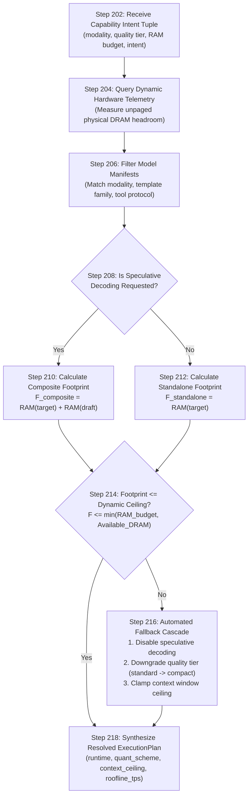
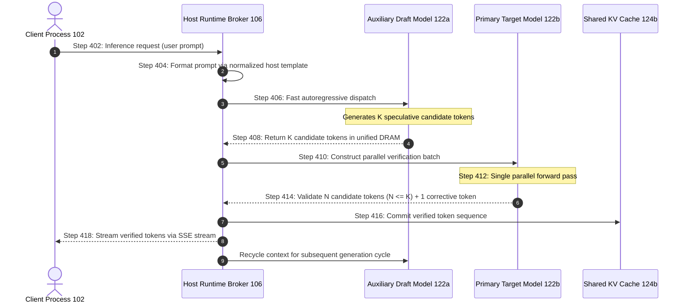

# Patent Claims & Architecture Specification

| Attribute | Specification |
| :--- | :--- |
| **Title** | System and Method for Host-Managed Multi-Client Model Capability Routing, Shared Unified Memory Storage, and Coordinated Speculative Decoding |
| **Filing Type** | U.S. Patent Application |
| **Assignee** | VDP Labs |
| **Formal Documents** | [`Docs/Patent/Pantry Patent Specification.pdf`](Patent/Pantry%20Patent%20Specification.pdf) · [`Docs/Patent/Pantry Patent Drawings.pdf`](Patent/Pantry%20Patent%20Drawings.pdf) |
| **Open Source Reference Implementation** | [Pantry](https://github.com/vdplabs/pantry) (Released under the [MIT License](../LICENSE)) |
| **Related Specifications** | [RFC-0004](https://github.com/vdplabs/sink/blob/main/Docs/RFC-0004-mac-model-host.md), [RFC-0005](https://github.com/vdplabs/sink/blob/main/Docs/RFC-0005-capability-resolve-pull-run.md), [RFC-0006](https://github.com/vdplabs/sink/blob/main/Docs/RFC-0006-chunked-cas-quantization-dedup.md) |

---

## Executive Summary

This specification provides the technical and architectural mapping between the formal **VDP Labs Patent Specification** and the open-source **Pantry** model host engine. Pantry serves as the canonical open reference implementation of the invention, proving its viability, performance benefits, and hardware efficiency on consumer Apple Silicon and enterprise NVIDIA CUDA accelerators.

The patent encompasses twelve claims organized into three statutory categories:
1. **Method Claims (Claims 1–7)**: Automated capability arbitration (FIG. 2), multi-model speculative decoding coordination (FIG. 4), single-instance physical storage, host-owned prompt templating, and zero-copy read-only page sharing.
2. **System Claims (Claims 8–10)**: Host model broker coupled with shared unified DRAM/VRAM architecture, dynamic allocation telemetry, and non-volatile single-instance storage.
3. **Computer-Readable Medium Claims (Claims 11–12)**: Machine-executable instructions executing capability intent resolution and MLX speculative decoding token generation and parallel verification.

---

## Patent Claims Mapping to Codebase

| Claim # | Claim Scope & Technical Innovation | Codebase Implementation |
| :--- | :--- | :--- |
| **Claim 1** | **Capability Intent Routing & Dynamic DRAM Telemetry (FIG. 2)**: Receiving intent tuple devoid of model filename, querying hardware telemetry for available unpaged DRAM, resolving optimal model manifest within headroom, mapping weights zero-copy into shared unified memory space, and executing inference. | [`src/pantry/resolve.py::resolve()`](../src/pantry/resolve.py)<br>[`src/pantry/memory.py::get_available_unified_dram()`](../src/pantry/memory.py)<br>[`src/pantry/schemas.py::CapabilityRequest`](../src/pantry/schemas.py) |
| **Claim 2** | **Multi-Model Speculative Decoding Pair Allocation**: Identifying draft model $M_d$ and target model $M_t$ in common architectural family and allocating both within shared unified memory. | [`src/pantry/resolve.py` (Steps 208–216)](../src/pantry/resolve.py)<br>[`src/pantry/runtime.py::MlxRuntime`](../src/pantry/runtime.py) |
| **Claim 3** | **Coordinated Speculative Token Generation & Verification (FIG. 4)**: Iterative generation of $K$ candidate tokens by draft model on GPU, single parallel verification step of candidate tokens by target model, and streaming accepted tokens. | [`src/pantry/runtime.py` (speculative loop)](../src/pantry/runtime.py)<br>[`src/pantry/hardware.py::estimate_speculative_speedup()`](../src/pantry/hardware.py) |
| **Claim 4** | **Centralized Shared Single-Instance Storage (FIG. 3)**: Single physical disk instance under `$PANTRY_DATA` accessible to multiple client application sandboxes without duplicating weights into private containers. | [`src/pantry/store.py::PackageStore`](../src/pantry/store.py)<br>[`src/pantry/cas.py::CasManager`](../src/pantry/cas.py) |
| **Claim 5** | **Host-Owned Chat Templates & Stop-Token Stripping**: Normalizing incoming prompt payloads against host-maintained chat templates (ChatML, Llama, Mistral) and stripping special stop tokens so clients are decoupled from template specifications. | [`src/pantry/template.py`](../src/pantry/template.py)<br>[`src/pantry/server.py` (chat completions)](../src/pantry/server.py) |
| **Claim 6** | **OpenAI-Compatible Local Loopback API**: Exposing an HTTP server on local loopback interface (`127.0.0.1:18787`) implementing OpenAI-compatible SSE streaming endpoints. | [`src/pantry/server.py::create_app()`](../src/pantry/server.py) |
| **Claim 7** | **Read-Only Memory Page Sharing**: Initializing read-only virtual memory pages shared across concurrent inference requests originating from different sandboxed client applications. | [`src/pantry/shm.py::ShmManager`](../src/pantry/shm.py)<br>[`src/pantry/store.py`](../src/pantry/store.py) |
| **Claim 8** | **Unified Memory System Architecture**: Processor executing host model broker measuring dynamic physical DRAM allocation and mapping optimal weights zero-copy into DRAM pool. | [`src/pantry/server.py::Service`](../src/pantry/server.py)<br>[`src/pantry/memory.py::snapshot()`](../src/pantry/memory.py) |
| **Claim 9** | **System Speculative Token Orchestration**: Host broker orchestrating draft model generation and batched target model verification within physical DRAM. | [`src/pantry/runtime.py`](../src/pantry/runtime.py) |
| **Claim 10** | **System Single-Instance Physical Disk Guarantee**: Single instance on non-volatile storage executing concurrent inference without containerized duplication. | [`src/pantry/cas.py::CasIndex`](../src/pantry/cas.py) |
| **Claim 11** | **Computer-Readable Medium Instructions**: Resolving capability intent parameters and exposing weights to hardware accelerator via shared memory-mapped buffer. | [`src/pantry/resolve.py`](../src/pantry/resolve.py)<br>[`src/pantry/cli.py`](../src/pantry/cli.py) |
| **Claim 12** | **MLX Speculative Decoding Integration**: Non-transitory medium configuring curated draft/target pairs for speculative decoding within an Apple Silicon MLX framework. | [`src/pantry/runtime.py`](../src/pantry/runtime.py)<br>[`catalog/`](../catalog/) |

---

## Detailed Architectural Walkthrough of Patent Figures

### FIG. 1: Multi-Client Host Architecture
```
┌─────────────────────────────────────────────────────────────┐
│                   COMPUTING ENVIRONMENT 100                 │
│                                                             │
│  ┌────────────────────────┐      ┌───────────────────────┐  │
│  │ Sandboxed Client 102a  │      │ Independent CLI 102b  │  │
│  └───────────┬────────────┘      └───────────┬───────────┘  │
│              │ Inter-Process                 │ Local        │
│              │ Communication 104             │ Socket / HTTP│
│              ▼                               ▼              │
│       ┌──────────────────────────────────────────────┐      │
│       │        HOST RUNTIME BROKER 106               │      │
│       │  ┌────────────────────┐ ┌─────────────────┐  │      │
│       │  │ Capability Engine  │ │ Template Layer  │  │      │
│       │  └────────────────────┘ └─────────────────┘  │      │
│       └──────────────────────┬───────────────────────┘      │
│                              │                              │
│              ┌───────────────┴───────────────┐              │
│              ▼                               ▼              │
│  ┌────────────────────────┐      ┌───────────────────────┐  │
│  │   SHARED MEMORY 120    │      │ CENTRALIZED STORAGE   │  │
│  │ ┌────────────────────┐ │      │ ┌───────────────────┐ │  │
│  │ │ Draft Model 122a   │ │      │ │ CAS Chunk Store   │ │  │
│  │ ├────────────────────┤ │      │ ├───────────────────┤ │  │
│  │ │ Target Model 122b  │ │      │ │ Single-Instance   │ │  │
│  │ ├────────────────────┤ │      │ │ Model Weights 114 │ │  │
│  │ │ Shared KV Cache    │ │      │ └───────────────────┘ │  │
│  │ └────────────────────┘ │      └───────────────────────┘  │
│  │ Physical DRAM Pool 124 │                                 │
│  │ Accelerator / GPU 126  │                                 │
│  └────────────────────────┘                                 │
└─────────────────────────────────────────────────────────────┘
```

---

### FIG. 2: Capability Resolution & Telemetry Interrogation Flow (Claim 1)



#### Roofline Throughput Model (Step 208)
Pantry calculates the predicted generation throughput using physical memory bus bandwidth:

$$\text{TPS}_{\text{est}} = \left( \frac{\mathcal{B}_{\text{bus}}}{\mathcal{W}_{\text{model}}} \right) \times 0.55$$

Where:
- Apple M1/M2/M3/M4 Base: 68–150 GB/s
- Apple Pro: 150–200 GB/s
- Apple Max: 300–400 GB/s
- Apple Ultra: 800 GB/s
- NVIDIA DGX / A100 / H100: 1,555–3,350 GB/s

---

### FIG. 3: Single-Instance Storage & CAS Chunk Deduplication (Claim 4 & RFC-0006)

Pantry implements chunk-level Content-Addressable Storage under `$PANTRY_DATA/cas/`:
- **Cryptographic Chunk Store**: SHA-256 addressed chunks partitioned by two-character prefix directory sharding (`cas/chunks/4a/4a8f...chunk`).
- **Cross-Quantization Deduplication**: Modern model families share invariant weight tensors across quantization tiers:
  - Token Embeddings (`embed_tokens`): 100% shared across 4-bit, 8-bit, and 16-bit quants.
  - Normalization Layers (`rms_norm`): 100% shared.
  - Vision Towers (SigLIP / CLIP): 100% shared.
- **Zero-Copy APFS Materialization**: Uses `copyfile(..., COPYFILE_CLONE)` to construct virtual weight trees with zero physical disk duplication and zero read latency.

---

### FIG. 4: Coordinated Speculative Decoding Execution (Claims 2, 3, 9, 12)



---

## Interactive CLI Patent Inspection

Developers and auditors can inspect the patent claims and active host telemetry directly from the terminal:

```bash
# Formatted human-readable briefing
pantry patent

# Structured JSON export for CI and automated verification
pantry patent --json
```

---

## Open Source Licensing & Public Implementation Rights

The Pantry codebase is distributed under the permissive **[MIT License](../LICENSE)**:

```
MIT License
Copyright (c) 2026 VDP Labs
```

VDP Labs grants royalty-free permission to any person obtaining a copy of this software to use, copy, modify, merge, publish, distribute, sublicense, and sell copies of the Software in accordance with the MIT License terms.
