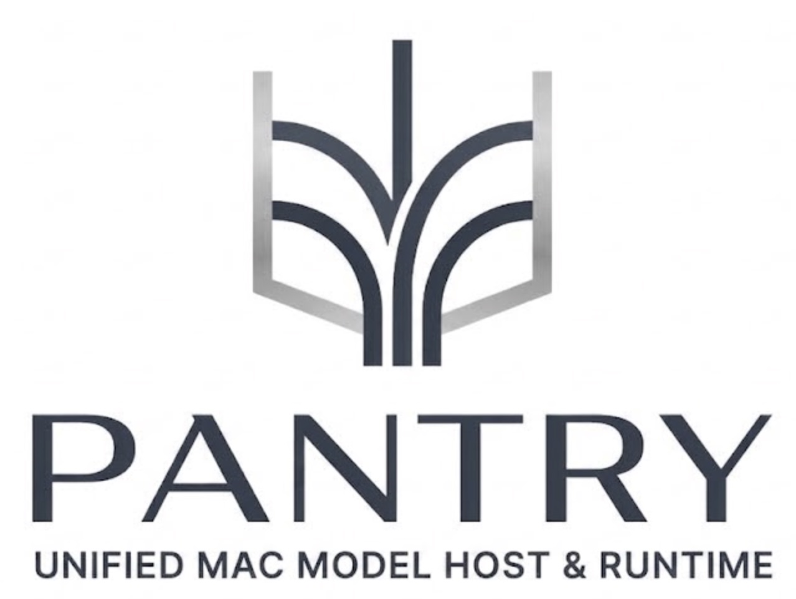

<p align="center">
  
</p>

# pantry

**pantry** is a local model host for Apple Silicon: one shared library of model packages, a small daemon that loads and runs them, and an OpenAI-compatible HTTP API so any app (or `curl`) can be a client.

Clients ask for *capabilities* — chat, fit in 8 GB RAM, prefer speed — and pantry resolves a concrete package, applies the right chat template, and streams tokens. Weights live once on disk; many apps reuse them.

## Status

| | |
| --- | --- |
| **Version** | **v0.5.1** — usable alpha (MIT, pip) |
| **Ships today** | Capability resolve · **shared library** under `PANTRY_HOME`/`PANTRY_DATA` (transparent Hugging Face cache snapshot reuse; one copy on disk) · `pantry serve` OpenAI-compatible HTTP + SSE · MLX chat on Apple Silicon with **exact token usage** · **Host-owned templates** (ChatML/Llama) + stop-token stripping · **Curated speculative decoding** (`chat-fast`, draft/target pairs) · Expanded catalog (Qwen 2.5 0.5B/1.5B/Coder, Llama 3.2 1B/3B, DeepSeek-R1) · Unified-memory / Metal watchdog |
| **Optional Real Engines** | Speech-to-text (`mlx-whisper` via `/v1/audio/transcriptions`) · Image generation (`mflux` via `/v1/images/generations`) |
| **Scaffolds / Demos** | Music HTTP endpoint (`echo_music` sine scaffold for client wiring) · Embeddings (`echo_embed` scaffold default; MLX runtime available) |
| **Secondary Features** | Worker subprocess isolation (`--worker-isolation`) · Login LaunchAgent daemon (`pantry service`) · Single-endpoint catalog sync (`pantry catalog update`) · Prompt-injected tool calling |
| **Roadmap (not shipped)** | Real MAGNeT music engine on Apple Silicon · CAS blob layer for weight trees · Multi-publisher catalog federation · Unix domain sockets / Mach zero-copy IPC |

Transparency over hype: clone it, run the tests, chat or generate images with local weights — those paths are real. Scaffolds like `echo_music` are honest placeholders for client integration while real engines are developed.

## Intent over tags

Client apps should request **capabilities and memory budgets**, not hardcoded Hugging Face repo names or quant tags.

| Instead of… | Ask pantry for… |
| --- | --- |
| `mlx-community/Qwen2.5-…-4bit` baked into the app | `modality=chat`, `ram_gb_max=8`, `quality_tier=compact` |
| Every app re-picking “which Q4 fits this Mac?” | One resolve answer for **this** machine’s unified memory |
| Shipping a new app build when the best pack changes | Soft aliases (`chat-compact`) + catalog updates on the host |

```bash
# Intent: “chat that fits ~8 GB, prefer compact”
pantry resolve --modality chat --ram-gb-max 8 --quality compact

# Same idea over HTTP
curl -s http://127.0.0.1:18787/v1/resolve \
  -H 'content-type: application/json' \
  -d '{"modality":"chat","ram_gb_max":8,"quality_tier":"compact"}'
```

Power users can still pin a package id when they want exact weights. The default product path is **intent → resolve → package**, so apps stay portable across Macs and pantry can swap in better packs (or respect memory pressure) without rewriting clients.

## How pantry differs from Ollama / llama.cpp

Ollama and llama.cpp are excellent. pantry is not a feature-for-feature clone — it targets a **shared Mac host** that apps call by capability.

| | **Ollama / llama.cpp server** | **pantry (today)** |
| --- | --- | --- |
| **How clients name models** | Pull/run by **tag** or GGUF path (`llama3.2:3b`, file path) | **Capability resolve** (`modality`, `ram_gb_max`, `quality_tier`, aliases like `chat-compact`) *or* pin a package id |
| **Who owns prompt format** | Often client- or model-card dependent | **Host-owned** templates + stop-token stripping so resolve cannot strand clients |
| **On-disk library** | Per-tool / per-app installs are common; sharing is manual | **One shared library** under `PANTRY_HOME` / `PANTRY_DATA` so apps reuse the same pulled weight trees (blob CAS helpers exist; HF pulls are package dirs today) |
| **Transport** | Localhost HTTP (OpenAI-compatible) | **Same today** — OpenAI-compatible HTTP on `127.0.0.1`. UDS / Mach / zero-copy IPC is **roadmap**, not claimed as done |
| **Apple Silicon focus** | Cross-platform; Metal via various backends | **MLX-first** chat + unified-memory / Metal cache watchdog |
| **Multi-modal** | Varies by project | Chat is real MLX; STT (`mlx-whisper`) and image (`mflux`) have real engines with demo fallbacks; music is an honest echo scaffold until real engines land |

OpenAI HTTP is the **adapter** for adoption. Differentiation is resolve + shared store + Apple-aware planning — not another chat UI.

## Motivation

Today, every Mac AI app tends to become its own model manager:

| Reality | Cost |
| --- | --- |
| Each app downloads its own copy of the same weights | Disk waste, slow first-run, confusing “which folder?” support |
| Users pick Hub IDs / quants per app | “Which Q4 fits my Mac?” answered differently everywhere |
| Pull + OpenAI HTTP servers (Ollama, gmlx, …) | Excellent interop; weak shared broker, capability API, and Apple-aware planning |

We want one place that can answer, for this machine:

- **What can run?**
- **What is installed?**
- **What is loaded?**
- **How good / how fast is it on this chip?**

## Goals

1. **Shared package library** — weights + tokenizer metadata + chat template + quality/eval notes under one user library root (optionally on external storage) so apps do not each keep a private copy.
2. **Installable daemon** — `brew tap vdplabs/tap && brew install pantry`, or `pip` / `uv`; `pantry serve` on localhost (menu bar on by default).
3. **Capability API** — resolve by modality, RAM budget, quality tier, latency class, template/tool constraints — not only raw Hub IDs.
4. **MLX on Metal first** — practical path on Apple Silicon via `mlx-lm`; other backends later where packages declare them.
5. **Host-owned semantics** — pantry applies chat templates and strips model stop tokens so resolve cannot silently strand clients on the wrong prompt format.
6. **Curated quality tiers** — `standard` / `compact` / `extreme`, with room for measured evals on smaller quants (no silent “enable Q2 on everything”).
7. **Acceleration over time** — speculative decode for curated draft/target pairs; optional MLC / ANE paths only when measured wins justify them.

## Why pantry is different

pantry is **not** “another chat window” and **not** a feature-for-feature clone of Ollama.

| Pillar | What it means |
| --- | --- |
| **One download, many apps** | Shared `PANTRY_HOME` / `PANTRY_DATA` library; clients reuse the same pulled trees |
| **Capability resolve** | Apps request constraints; host picks a package |
| **Quality tiers** | Curated packs with honest size/quality tradeoffs |
| **Runtime planner** | Package declares engine (MLX today); host can add draft models / fallbacks later |
| **Host-owned templates** | Resolve is safe only if the host owns prompt shaping and stops |
| **HTTP as interop** | OpenAI-compatible wire format for adoption — differentiation is resolve + store + planner, not a localhost ChatGPT UI |

## Non-goals (current)

- Shipping through the Mac App Store as the primary distribution
- Training / fine-tune cookbooks as the core product
- Guaranteeing every GGUF or every Hugging Face repo on day one
- Competing with Hugging Face as a mirror CDN
- A built-in chat playground UI inside the daemon

## Architecture (sketch)

```
┌──────────┐  ┌──────────┐  ┌──────────┐
│ App A    │  │ App B    │  │ CLI/curl │
└────┬─────┘  └────┬─────┘  └────┬─────┘
     │             │             │
     └─────────────┼─────────────┘
                   ▼
         ┌─────────────────┐
         │  pantry serve   │
         │  resolve / pull │
         │  chat complete  │
         └────────┬────────┘
    ┌─────────────┼─────────────┐
    ▼             ▼             ▼
 Package       Runtime        Status
   store       (MLX / …)      CLI
```

Default API: `http://127.0.0.1:18787`. Paths: see [Configuration](#configuration).

## Install

Requires Python 3.11+ on Apple Silicon.

**Homebrew** ([vdplabs/homebrew-tap](https://github.com/vdplabs/homebrew-tap)):

```bash
brew tap vdplabs/tap
brew install pantry
```

**pip (recommended from a clone)** — MLX inference + menu bar (what `pantry serve` expects):

```bash
python3.12 -m venv .venv
source .venv/bin/activate
pip install -e ".[mac]"
# equivalent: pip install -e ".[mlx,menubar]"
```

Dev tools on top:

```bash
pip install -e ".[mac,dev]"
```

Without menu bar extras, `pantry serve` still runs HTTP but prints that the menu bar was skipped.

## Configuration

| Variable / flag | Role |
| --- | --- |
| `PANTRY_HOME` / `--home` | **Metadata** root: `state.json`, package manifests (small) |
| `PANTRY_DATA` or `PANTRY_BLOBS` / `--data` | **Heavy content**: content-addressed `blobs/`, pulled weight trees, generated artifacts |
| Default (both unset) | `~/Library/Application Support/VDPPantry/` for both (single-directory layout) |

**Base Macs with 256 GB / 512 GB internal SSDs:** keep metadata on the internal volume and put multi‑GB weights on an external APFS Thunderbolt SSD:

```bash
export PANTRY_HOME="$HOME/Library/Application Support/VDPPantry"
export PANTRY_DATA="/Volumes/Models/VDPPantry"

pantry init
pantry pull vdplabs.qwen25-0.5b.compact.v1
pantry serve
# or: pantry serve --home "$PANTRY_HOME" --data "$PANTRY_DATA"
```

`pantry status` and `GET /v1/health` report both `home` and `data` paths. Relocating only `PANTRY_HOME` still works if you want the entire library on one external volume.

## Quick start

```bash
pantry init
pantry pull vdplabs.qwen25-0.5b.compact.v1   # ~290 MB starter / draft
pantry pull vdplabs.qwen25-1.5b.standard.v1  # ~870 MB standard (+ speculative target)
pantry serve                                   # http://127.0.0.1:18787 + menu bar
```

```bash
curl -s http://127.0.0.1:18787/v1/health | jq

curl -s http://127.0.0.1:18787/v1/chat/completions \
  -H 'content-type: application/json' \
  -d '{
    "model": "chat-compact",
    "messages": [{"role":"user","content":"hello"}],
    "max_tokens": 64
  }' | jq
```

### Capability resolve

```bash
pantry resolve --modality chat --ram-gb-max 8 --quality compact

curl -s http://127.0.0.1:18787/v1/resolve \
  -H 'content-type: application/json' \
  -d '{"modality":"chat","ram_gb_max":8,"quality_tier":"compact"}' | jq
```

## CLI

| Command | Purpose |
| --- | --- |
| `pantry init` | Create library dirs and seed the bundled catalog |
| `pantry pull <package_id>` | Download package weights (Hugging Face) |
| `pantry resolve …` | Pick a package from capability constraints |
| `pantry list` | Installed packages |
| `pantry load` / `unload` | Mark warm / release; unload clears MLX cache (or shuts down isolated worker) |
| `pantry serve` | HTTP server **+ Mac menu bar** (`--no-menubar` to disable; `--worker-isolation` for subprocess Metal reclaim on unload) |
| `pantry status` / `pantry health` | Library / HTTP health (includes memory) |
| `pantry service install` / `start` / `stop` / `status` | Manage login LaunchAgent daemon (`com.vdplabs.pantry.serve`) |
| `pantry chat "<prompt>"` | Interactive or one-shot local chat via MLX (supports `--speculative`) |
| `pantry transcribe <file>` | Local speech-to-text audio transcription via Whisper |
| `pantry image "<prompt>"` | Generate an image on Apple Silicon Metal via mflux (or demo) |
| `pantry music "<prompt>"` | Synthesize music audio via echo scaffold |

## HTTP API

| Method | Path | Notes |
| --- | --- | --- |
| `GET` | `/v1/health` | Process + library + Metal memory pressure |
| `GET` | `/v1/memory` | Full unified-memory watchdog snapshot |
| `POST` | `/v1/memory/clear` | Reclaim MLX Metal free cache |
| `GET` | `/v1/models` | Listable packages (one id each) with `role` / `modalities`. Echo/demo packs omitted by default; `?demos=1` includes them; `?ready_only=1` hides unpulled |
| `POST` | `/v1/chat/completions` | Live SSE streaming; exact token counts; tool/function calling support |
| `POST` | `/v1/embeddings` | Vector embeddings (`modality=embed`); single or batched inputs |
| `POST` | `/v1/audio/transcriptions` | OpenAI Speech-to-Text format (`multipart/form-data`) powered by `mlx-whisper` (`json`, `verbose_json`, `text`, `vtt`, `srt`) |
| `POST` | `/v1/images/generations` | OpenAI image generation format powered by `mflux` (FLUX.1-schnell/dev) or `echo_image` scaffold |
| `POST` | `/v1/audio/generations` | Music packs (`echo_music` scaffold today) |
| `POST` | `/v1/resolve` | Capability → package (strict modality) |
| `POST` | `/v1/pull` | `{ "package_id": "…" }` |
| `POST` | `/v1/unload` | Drop warm runtime weights |

## Packages & quality tiers

A **package** is an immutable manifest plus on-disk weights (when pulled). Manifests declare family, RAM floors, modalities, template family, runtime, and optional eval notes.

| Tier | Intent |
| --- | --- |
| `standard` | Default quality balance |
| `compact` | Smaller / faster; slight quality tradeoff |
| `extreme` | Max fit / speed; expect quality loss; ship with eval notes |

Capability aliases such as `chat-compact` resolve to a concrete package id on the host.

## Documentation

Deeper reference lives under [`Docs/`](Docs/README.md):

- [Architecture](Docs/Architecture.md)
- [Packages](Docs/Packages.md)
- [Modalities](Docs/Modalities.md)
- [Memory](Docs/Memory.md)
- [API](Docs/API.md)
- [Speculative](Docs/Speculative.md)
- [Install](Docs/Install.md) (pip / uv / Homebrew)
- [Launchd](Docs/Launchd.md)

## Menu bar

Included when you install with `.[mac]` or `.[menubar]`. `pantry serve` opens the status item automatically; use `--no-menubar` for HTTP-only.

The menu shows online status, unified-memory pressure, models / loaded packs, and **Quit pantry** (stops the server).

## Development

```bash
python3.12 -m venv .venv
source .venv/bin/activate
pip install -e ".[mac,dev]"
pytest
```

## License

MIT
